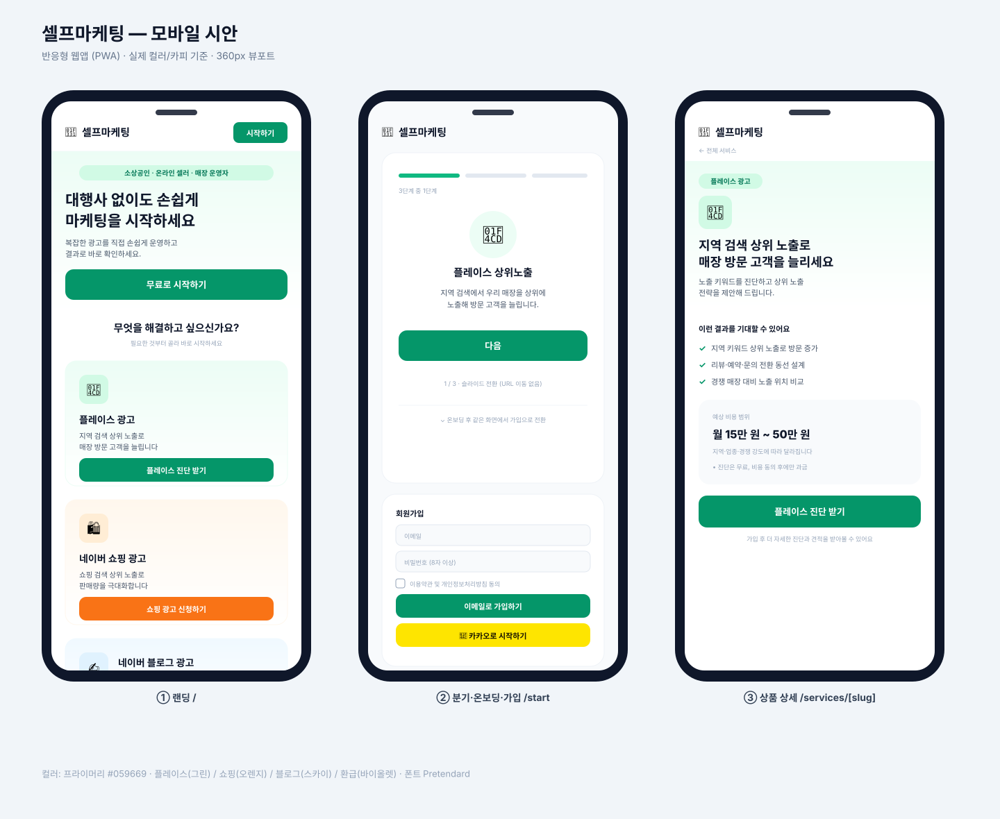
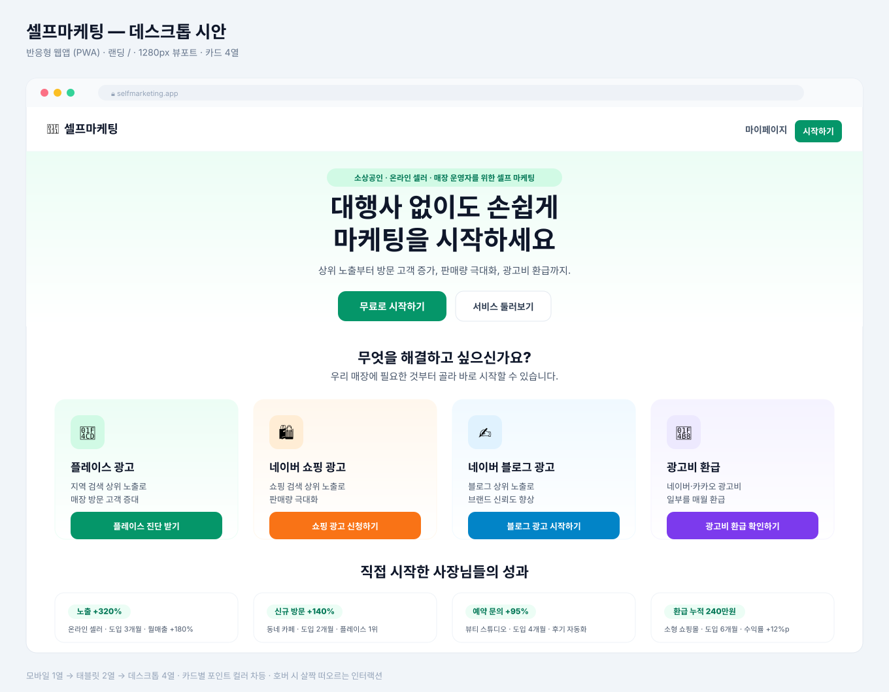

# 셀프마케팅 — 디자인 시안 (Design Preview)

소상공인·온라인 셀러·매장 운영자를 위한 셀프 마케팅 플랫폼의 **모바일/PC 최적화 반응형 웹앱(PWA)** 시안입니다.
실제 구현의 컬러·카피·레이아웃을 그대로 반영했습니다.

> 폰트는 GitHub 환경 폰트로 대체되어 한글 위치가 약간 달라 보일 수 있습니다.
> 정확한 모습은 `npm run dev`로 실제 페이지에서 확인하세요.

---

## 📱 모바일 (360px)

① 랜딩 `/` · ② 분기·온보딩·가입 `/start` · ③ 상품 상세 `/services/[slug]`

---

## 🖥️ 데스크톱 (1280px)

랜딩 `/` — 4열 서비스 카드 + 성공 사례

---

## 🎨 디자인 토큰

| 항목 | 값 |
|---|---|
| 프라이머리 | `#059669` (emerald-600) |
| 플레이스 광고 | 그린 `#059669` |
| 네이버 쇼핑 광고 | 오렌지 `#f97316` |
| 네이버 블로그 광고 | 스카이 `#0284c7` |
| 광고비 환급 | 바이올렛 `#7c3aed` |
| 폰트 | Pretendard (system-ui 폴백) |
| 반응형 | 카드 모바일 1열 → 태블릿 2열 → 데스크톱 4열 |
